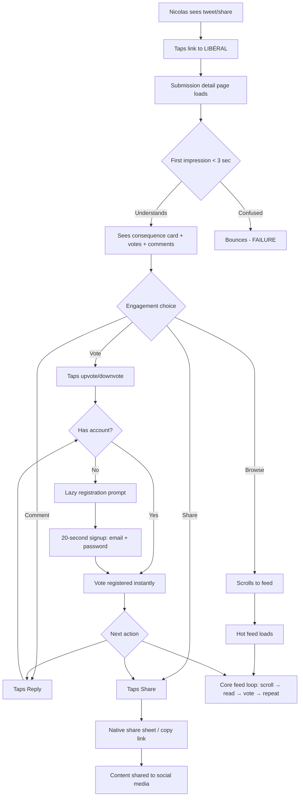
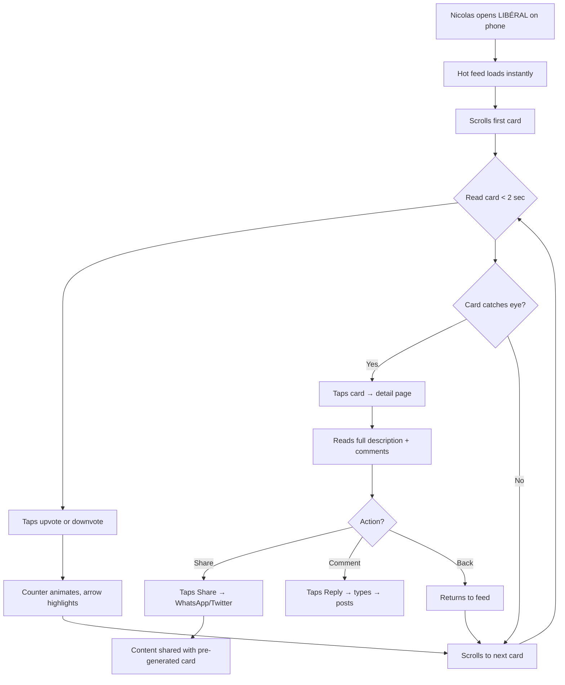
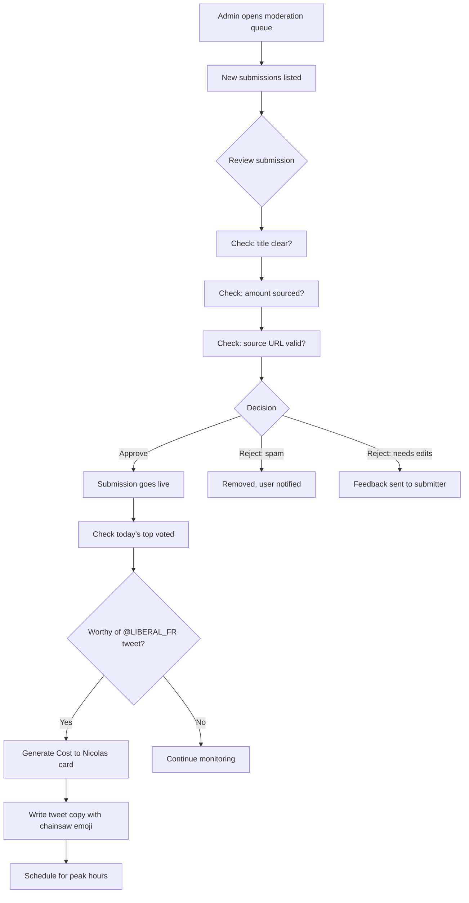

# UX Design Specification LIBÉRAL

**Author:** Tirakninepeiijub
**Date:** 2026-02-27

---

## Executive Summary

### Project Vision

LIBÉRAL is a community-driven fiscal accountability platform where French citizens — collectively embodied as **NICOLAS**, the average overtaxed taxpayer — submit government waste items, vote them up/down, discuss them through comments, and share auto-generated impact cards to social media. Inspired by Javier Milei's Argentine chainsaw movement.

The core loop: **Submit → Community Discusses & Votes → Consequences Calculated → Share to Twitter/X**

The platform is democratic at every level: users submit, users vote, users comment, users decide what features get built next. It functions as a social media platform focused on fiscal accountability — not a static data portal.

### Target Users

**NICOLAS** — every French taxpayer. A single unified persona spanning:

- **The Discoverer:** Arrives via a viral tweet or WhatsApp share. First experience is a submission page with a striking impact card. Must understand, engage, or share within 30 seconds.
- **The Passive Voter:** 2 minutes/day on a commute. Scrolls Hot feed, upvotes 3 items, downvotes 1, shares one to WhatsApp. High-impact at minimum effort.
- **The Active Submitter:** Researches government waste, submits with source links, adds context, engages in comments. The content engine.
- **The Commenter:** Adds context, challenges claims, provides additional sources, debates consequences. The social layer.
- **The Admin/Moderator:** Reviews submission queue, curates @LIBERAL_FR broadcasts, manages flagged content. Power user.

**Device profile:** 70%+ mobile (social media referral traffic), one-thumb operation, 4G connections. Desktop secondary for submission research and admin tasks.

**Tech literacy range:** Basic smartphone user (grandparent sharing on WhatsApp) to developer (contributing PRs on GitHub). UX must serve both extremes.

### Key Design Challenges

1. **30-second social referral onboarding** — Most traffic arrives from Twitter/X or WhatsApp links to a specific submission. Nicolas must instantly understand what LIBÉRAL is, see the impact, and either share, vote, comment, or explore — without friction. The submission page IS the landing page.

2. **Mobile-first voting and scrolling** — One-thumb operation. Vote buttons at thumb-reach, feed scrolling, share actions. Optimistic UI with 100ms perceived response. No modals, no confirmation dialogs for voting.

3. **Social media commenting UX** — Comments on every submission. Threaded or flat. Must feel natural like Twitter/Reddit, not like a form. Low friction to comment, easy to read through discussions.

4. **Credibility vs. outrage** — The platform runs on emotional resonance (chainsaw, fiscal anger), but credibility comes from verified sources and transparent calculations. Source links and methodology must be visible without killing emotional momentum.

5. **Submission form as creative expression** — 4+ fields (title, description, EUR amount, source URL) must feel like posting content, not filling out paperwork. The submission experience should feel empowering — Nicolas is wielding the chainsaw.

6. **Multiple consequence types** — "Cost to Nicolas" (EUR per citizen/taxpayer/household) is one type of consequence. Submissions may have other impact dimensions: jobs lost, services cut, environmental damage, opportunity cost. The UX must accommodate flexible consequence display.

### Design Opportunities

1. **The impact card as signature UX element** — A distinctive, recognizable visual format for sharing. When Nicolas sees that card format on social media, they know it's LIBÉRAL. The card is the brand. It shows consequences (including but not limited to Cost to Nicolas) in a visceral, shareable format.

2. **Emotional data design** — Turning "800 million EUR" into "44 EUR from YOUR pocket, or 2.4 hours of YOUR work" through typography, scale, color, and metaphor. Data as outrage fuel.

3. **Zero-friction democratic participation** — Voting, commenting, and feature voting should feel instant, alive, and impactful. The feed reorders. Vote counters animate. Comments appear in real-time. Nicolas feels like part of a living movement.

4. **Chainsaw visual identity** — Bold, aggressive, memorable. Not bland civic tech. The chainsaw is a UI accent, a loading animation, a celebration on viral moments. It cuts through bureaucracy visually.

5. **Social media DNA** — Comments, discussions, reactions on every submission. The platform feels like a social network focused on fiscal accountability — not a database with a voting widget.

## Core User Experience

### Defining Experience

**The ONE interaction that defines LIBÉRAL:** Scrolling a feed of fiscal outrages, seeing the consequences, and reacting — voting, commenting, or sharing — in under 3 seconds per item.

The core loop has two modes:

**Consumer mode (80% of interactions):**
```
Open feed → Scroll → React (vote/comment/share) → Repeat
```

**Creator mode (20% of interactions):**
```
Discover waste → Submit with source → Community discusses & votes → Consequences emerge → Share
```

The platform is a **social media for fiscal accountability**. Not a data tool with a voting widget — a living, commenting, reacting community where Nicolas discusses government spending the same way people discuss posts on Twitter or Reddit.

### Platform Strategy

| Dimension | Decision |
|-----------|----------|
| Primary platform | Mobile web (responsive, PWA-ready) |
| Input mode | Touch-first (one-thumb operation) |
| Traffic source | 70%+ from social media referral links |
| Landing experience | Individual submission page (not homepage) |
| Secondary | Desktop web for submission research, admin moderation |
| Offline | Not for MVP — content is inherently live/social |
| Key device capability | Share API for native sharing on mobile |

### Effortless Interactions

1. **Voting** — Tap to upvote/downvote. No confirmation, no modal, no login prompt (until they actually need to register). Instant visual feedback. Counter animates. Feed reorders.

2. **Sharing** — One tap → native share sheet (mobile) or copy-link (desktop). The share card is pre-generated. Zero formatting work for Nicolas.

3. **Commenting** — Tap reply on any submission. Type. Post. Like posting a tweet. No character limit for MVP, but clean threading. Comments are where democratic discussion lives.

4. **Browsing consequences** — Each submission shows its consequences at a glance: Cost to Nicolas figures, but also other impacts (jobs, services, opportunity costs) contributed by the community through comments and editorial context.

5. **Registration** — Invisible until needed. Nicolas can browse and read everything without an account. The moment they try to vote, comment, or submit — a minimal registration flow (email + password, 20 seconds). Then the action they wanted completes immediately.

### Critical Success Moments

| Moment | What Happens | If We Fail |
|--------|-------------|-----------|
| **The Landing** | Nicolas arrives from a tweet, sees a submission with its consequence card, source link, vote count, and comments. Instantly understands what LIBÉRAL is. | Bounces. Never comes back. |
| **The First Vote** | Nicolas taps upvote. The counter jumps. They feel impact. They scroll and vote on more. | Feels pointless. Leaves. |
| **The First Comment** | Nicolas adds context to a submission — "This is even worse than it looks, here's why..." | Friction kills participation. Platform stays silent. |
| **The First Share** | Nicolas shares a consequence card. It looks striking in their Twitter/WhatsApp timeline. Friends click through. | Card looks bland. No clicks. No virality. |
| **The First Submission** | Nicolas submits a waste item. It gets approved, gets votes, gets comments. They feel they contributed to the movement. | Form feels bureaucratic. They abandon. |
| **The Consequence Reveal** | Nicolas sees "This costs you 44 EUR/year" — the abstract becomes personal. | Numbers feel abstract. No emotional impact. |

### Experience Principles

1. **Social-first, data-second** — This is a social media platform about fiscal data, not a data platform with social features. Comments, votes, and discussions are core — not secondary.

2. **Democratic everything** — Users vote on submissions, comment freely, vote on features to build next. The community drives content, curation, and product direction. No editorial gatekeeping beyond basic moderation.

3. **Consequences, not just numbers** — "Cost to Nicolas" is one type of consequence. The platform shows multiple dimensions of impact: personal cost, societal cost, opportunity cost, comparative cost. The community enriches these through comments.

4. **Friction is the enemy** — Every interaction should take fewer taps than the user expects. Vote in 1 tap. Share in 2 taps. Comment in 3. Submit in under 60 seconds. Register only when necessary, in under 20 seconds.

5. **The card is the product** — The shareable consequence card is what spreads. It must be visually distinctive, emotionally impactful, and instantly readable at thumbnail size. If the card doesn't make Nicolas angry enough to share, nothing else matters.

## Desired Emotional Response

### Primary Emotional Goals

| Emotion | When | Why It Matters |
|---------|------|---------------|
| **Righteous outrage** | Seeing a waste item with its consequence card | This is the fuel. If Nicolas doesn't feel angry, he doesn't share. Controlled outrage drives virality. |
| **Empowerment** | Voting, commenting, submitting | Nicolas is wielding the chainsaw. He's not powerless — he's part of a movement that holds power accountable. |
| **Belonging** | Seeing vote counts rise, reading comments, seeing @LIBERAL_FR tweets | Nicolas is not alone. Millions feel this way. The community is the proof. |
| **Satisfaction** | After sharing a consequence card or submitting a waste item | "I did something about it." The act of sharing or contributing is itself the democratic action. |

### Emotional Journey Mapping

| Stage | Desired Emotion | Design Driver |
|-------|----------------|---------------|
| **Discovery** (arriving from a tweet) | Curiosity → Shock → "Wait, WHAT?" | The consequence card stops the scroll. The number hits personally. |
| **First scroll** (browsing the feed) | Mounting outrage → "It's even worse than I thought" | Each item compounds. The feed is a cascade of fiscal absurdity. |
| **First vote** | Agency → "My voice counts" | Instant visual feedback. The counter moves. Nicolas made an impact. |
| **First comment** | Expression → "I need to say something about this" | Low-friction commenting. Nicolas adds context, challenges, debates. Democratic. |
| **First share** | Pride + provocation → "Everyone needs to see this" | The card looks striking. Nicolas feels like a fiscal whistleblower. |
| **First submission** | Empowerment → "I'm wielding the chainsaw" | The submission flow feels like an act of civic courage, not bureaucracy. |
| **Return visit** | Habit + anticipation → "What outrage did I miss?" | The feed has new content. Nicolas's previous submission has 500 upvotes. Dopamine. |
| **Error/failure** | Frustration minimized → "I can fix this easily" | Clear error messages, no data loss, gentle guidance. Never let anger at the platform replace anger at the system. |

### Micro-Emotions

| Micro-Emotion | Priority | Context |
|---------------|----------|---------|
| **Trust** over Skepticism | Critical | Every number has a source link. Every calculation shows methodology. Trust is earned through radical transparency. |
| **Confidence** over Confusion | Critical | Nicolas knows exactly what to do at every moment. No ambiguous buttons, no mystery navigation. |
| **Excitement** over Anxiety | High | Submitting feels exciting, not stressful. No fear of "doing it wrong." The form helps, not judges. |
| **Accomplishment** over Frustration | High | Every action completes successfully with visible feedback. Voting worked. Submission received. Share sent. |
| **Belonging** over Isolation | High | Vote counts, comment threads, community size — Nicolas sees he's part of something bigger. |
| **Rebellious joy** over Grim duty | Medium | The chainsaw brand, the humor in absurdity, the satisfaction of exposing waste — this should feel like a guerrilla movement, not a chore. |

### Design Implications

| Emotion | UX Design Approach |
|---------|-------------------|
| Righteous outrage → | **Bold typography** for EUR amounts. Red/orange accent for consequence numbers. "Cost to Nicolas" figures rendered at 2-3x body text size. Personal pronouns ("YOUR taxes", "YOU paid for this"). |
| Empowerment → | **Chainsaw micro-interactions.** Vote button has weight — tap it, feel the impact. Submission success shows a chainsaw animation cutting through bureaucracy. Nicolas is the protagonist. |
| Belonging → | **Live social proof.** "4,827 Nicolas voted on this." Community counter in the header. Comment activity visible. @LIBERAL_FR follower count displayed. |
| Satisfaction → | **Completion celebrations.** Share sent → brief confetti/chainsaw animation. Submission approved → notification with vote count. First submission → "Welcome to the movement" toast. |
| Trust → | **Source-first design.** Source links are never hidden. "Verify this calculation" is always one tap away. Methodology link in the footer of every consequence card. |
| Rebellious joy → | **Irreverent microcopy.** "Wield the chainsaw" instead of "Submit." "Cut through the waste" instead of "Browse." Loading spinner is a spinning chainsaw. 404 page: "This page costs 0 EUR. Unlike most government projects." |

### Emotional Design Principles

1. **Outrage is the feature, not a bug** — The platform is designed to make Nicolas angry at government waste, not at the platform. Every UX decision should channel anger outward (toward fiscal irresponsibility) and never inward (toward confusing UI or broken flows).

2. **Every interaction is an act of democracy** — Voting, commenting, submitting, sharing — each action should feel meaningful and impactful. Nicolas is not a passive consumer. He's an active participant in fiscal accountability.

3. **Humor lives alongside anger** — The chainsaw is funny AND serious. The absurdity of waste IS the humor. The UX should have moments of dark humor and rebellious joy — the satisfaction of exposing the ridiculous with unchallengeable data.

4. **Trust through transparency** — Emotional impact requires trust. If Nicolas doubts the numbers, the outrage dies. Every emotion-driving element (consequence cards, cost figures, comparisons) must have a visible path to its source data. Transparency fuels believability fuels emotion.

5. **Celebrate the collective** — Individual actions are satisfying, but the power is collective. Show Nicolas that his vote joined 10,000 others. Show that his submission triggered a media investigation. The community's collective power is the ultimate emotional payoff.

## UX Pattern Analysis & Inspiration

### Inspiring Products Analysis

#### 1. Reddit — The Voting & Community Engine

| Dimension | What They Nail | Why It Matters for LIBÉRAL |
|-----------|---------------|---------------------------|
| **Voting** | Single-tap upvote/downvote. Score visible. No friction. Optimistic UI. | LIBÉRAL's core mechanic. Vote counts drive ranking and social proof. |
| **Feed algorithms** | Hot, New, Top (day/week/all-time). User chooses sorting. | LIBÉRAL needs identical feed sorts — Hot for engagement, New for fresh submissions, Top for greatest outrages. |
| **Comment threading** | Nested replies, collapsible threads, upvoting on comments. | LIBÉRAL comments need threading for democratic discussion. Comments ARE the social layer. |
| **Community self-governance** | Moderators from community, report/flag system, karma. | LIBÉRAL's democratic ethos — community moderates itself with minimal editorial gatekeeping. |
| **Anonymous participation** | Pseudonymous accounts, low barrier to create. | Nicolas doesn't need real identity. Speed to participation > identity verification. |

**Key takeaway:** Reddit proved that voting + threading + community governance can scale to millions. LIBÉRAL is Reddit for ONE topic: government waste.

#### 2. Twitter/X — The Viral Sharing Machine

| Dimension | What They Nail | Why It Matters for LIBÉRAL |
|-----------|---------------|---------------------------|
| **Card previews** | Open Graph cards render beautifully in timeline. Image, title, domain. | LIBÉRAL's consequence cards MUST render perfectly as Twitter cards. The card IS the viral mechanic. |
| **Quote tweets** | Repost with commentary. Adds context, spreads further. | The "quote politician tweet into LIBÉRAL" flow mirrors this. Nicolas adds fiscal context to a politician's tweet. |
| **Real-time feed** | New content appears instantly. Pull-to-refresh. Live counts. | Feed must feel alive. New submissions, vote count changes, comment activity — all in near real-time. |
| **Share actions** | One-tap share. Copy link. Native share sheet. | LIBÉRAL share flow must be equally frictionless. Pre-generated card, one tap, done. |
| **Thread format** | Sequential posts telling a story. Numbered. Scrollable. | Submission descriptions could support a "thread" format for complex waste explanations. |

**Key takeaway:** Twitter proved that a standardized content card format + frictionless sharing = viral distribution. LIBÉRAL's consequence card must be the most recognizable card on French Twitter.

#### 3. Product Hunt — The Upvote-Driven Launch Machine

| Dimension | What They Nail | Why It Matters for LIBÉRAL |
|-----------|---------------|---------------------------|
| **Daily ranking** | Items ranked by upvotes per day. Creates urgency and discovery. | LIBÉRAL's "Outrage of the Day" — top-voted waste item gets @LIBERAL_FR broadcast. |
| **Submission + discussion** | Maker submits, community discusses, votes decide ranking. | Identical to LIBÉRAL: submitter posts waste, community discusses and votes. |
| **Clean cards** | Each product = one card. Logo, name, tagline, upvote count. | LIBÉRAL submission cards: title, EUR amount, consequence summary, vote count. Dense but scannable. |
| **Lazy registration** | Browse freely, register to vote. Minimal friction. | LIBÉRAL's exact pattern — invisible registration until the moment Nicolas wants to act. |
| **Social proof badges** | "#1 Product of the Day" — creates FOMO and sharing. | "#1 Outrage of the Day" badge on LIBÉRAL's winning submission. Shareable status. |

**Key takeaway:** Product Hunt proved that daily upvote competitions drive engagement and return visits. LIBÉRAL adds the same mechanic to fiscal accountability.

#### 4. Change.org — Civic Engagement at Scale

| Dimension | What They Nail | Why It Matters for LIBÉRAL |
|-----------|---------------|---------------------------|
| **Personal impact framing** | "Join 42,847 people who signed." Social proof as motivation. | "4,827 Nicolas voted on this." The collective number IS the emotional driver. |
| **One-click participation** | Sign a petition in one click. Minimal commitment, maximum impact feeling. | Voting on LIBÉRAL = one tap. Same feeling of "I did something." |
| **Share after action** | After signing, immediate prompt to share on social. | After voting on LIBÉRAL → "Share this outrage" prompt with pre-generated card. |
| **Progress indicators** | "87% of goal reached" — creates momentum narrative. | LIBÉRAL submissions could show momentum: "Trending" badges, velocity indicators. |
| **Email digests** | Weekly highlights of petitions making impact. | LIBÉRAL weekly newsletter: "Top 5 outrages Nicolas exposed this week." |

**Key takeaway:** Change.org proved that making civic participation feel impactful and shareable creates self-reinforcing loops. LIBÉRAL applies this to fiscal accountability.

#### 5. TikTok — The Infinite Scroll Engagement Engine

| Dimension | What They Nail | Why It Matters for LIBÉRAL |
|-----------|---------------|---------------------------|
| **Vertical card scroll** | One piece of content fills the screen. Swipe for next. Instant engagement. | LIBÉRAL mobile feed should consider full-card scrolling for maximum impact per item. |
| **Algorithmic discovery** | New users get compelling content immediately. No follow graph needed. | LIBÉRAL must show the most outrageous items to new visitors. The Hot feed is the discovery engine. |
| **Creation tools** | In-app creation feels native and fun. Not a form — a creative act. | LIBÉRAL submission form should feel like creating content, not filling out paperwork. |

**Key takeaway:** TikTok proved that mobile-native, full-screen, low-friction content consumption drives insane engagement. LIBÉRAL's mobile feed should steal this energy.

### Transferable UX Patterns

#### Navigation Patterns

| Pattern | Source | LIBÉRAL Application |
|---------|--------|-------------------|
| **Tab bar with feed sorts** | Reddit (Hot/New/Top) | Bottom tab: Feed (with Hot/New/Top sub-tabs), Submit, Profile. Three-tab simplicity. |
| **Pull-to-refresh** | Twitter/TikTok | Pull down on feed to load new submissions. Tactile and familiar. |
| **Infinite scroll with cards** | All five apps | Feed is an infinite scroll of submission cards. No pagination. Load as you scroll. |
| **Floating action button** | Reddit mobile (compose) | FAB for "Submit waste" — always accessible, prominent, chainsaw-themed. |

#### Interaction Patterns

| Pattern | Source | LIBÉRAL Application |
|---------|--------|-------------------|
| **Optimistic voting** | Reddit | Tap vote → instant UI update → server sync in background. Never wait for network. |
| **Swipe actions** | TikTok/Twitter | Swipe right to upvote, left to downvote (optional gesture). Card-level swipe actions. |
| **Share sheet integration** | Twitter | Use native Web Share API on mobile. Pre-populated with consequence card image + link. |
| **Lazy registration wall** | Product Hunt | All read actions free. First write action (vote/comment/submit) triggers minimal registration. |
| **Comment with reply** | Reddit | Tap reply → inline text field expands. Submit with one button. Threaded under parent. |
| **Post-action share prompt** | Change.org | After voting → subtle "Share this?" prompt. Not a modal — a slide-up suggestion. |

#### Visual Patterns

| Pattern | Source | LIBÉRAL Application |
|---------|--------|-------------------|
| **Dense info cards** | Product Hunt | Each submission card: title, EUR amount, consequence summary, vote count, comment count, source indicator. All scannable in 2 seconds. |
| **Large metric typography** | TikTok (view counts) | Consequence EUR figures rendered BIG. "44 EUR/year" dominates the card. Impossible to miss. |
| **Badge system** | Product Hunt ("#1 of the Day") | "Outrage of the Day", "Most Voted This Week", "Trending" — badges create aspiration and social proof. |
| **Social proof counters** | Change.org | "X Nicolas voted" — always visible. Community size counter in header. Active users indicator. |
| **Color-coded severity** | Reddit (award levels) | Color gradient for outrage level: yellow (<1 EUR/citizen), orange (1-10 EUR), red (10-100 EUR), deep red (100+ EUR). |

### Anti-Patterns to Avoid

| Anti-Pattern | Why It Fails | LIBÉRAL Mitigation |
|-------------|-------------|-------------------|
| **Facebook-style engagement bait** | Manipulative prompts destroy trust. | Never gamify engagement artificially. The data drives outrage, not engagement tricks. |
| **Reddit's confusing nested threads** | Deep nesting on mobile is unreadable. | Maximum 2-level nesting. After that, "Continue this thread →" link. Keep mobile-readable. |
| **Change.org's aggressive email spam** | Sign one petition, get 20 emails. Erodes trust instantly. | Email sparingly. Weekly digest at most. Easy one-click unsubscribe. |
| **Twitter's algorithmic opacity** | Users don't know why they see what they see. | LIBÉRAL feeds are transparent: Hot = votes/time, New = chronological, Top = vote count. No mystery algorithm. |
| **TikTok's addictive dark patterns** | Infinite scroll without breaks, notification bombardment. | Include natural break points. No manipulative notification flooding. |
| **Civic tech's boring design** | Government portals are universally bland and institutional. | The chainsaw identity is the antidote. Civic tech that looks like a protest movement, not a government form. |
| **Form-heavy submission flows** | Multi-page forms kill submission rates. | One-page submission: title, amount, source URL, optional description. Four fields max. |
| **Mandatory registration walls** | "Sign up to continue" when user just wants to browse. | Nicolas reads everything freely. Registration invisible until first write action. |

### Design Inspiration Strategy

**What to Adopt Directly:**

| Pattern | Source | Rationale |
|---------|--------|-----------|
| Optimistic voting with instant visual feedback | Reddit | Core mechanic must feel zero-latency. Non-negotiable. |
| Lazy registration (read-free, register-to-write) | Product Hunt | Maximizes discovery-to-engagement conversion. |
| Native share sheet with pre-generated card | Twitter | The sharing flow must be frictionless or virality dies. |
| Feed sorting tabs (Hot/New/Top) | Reddit | Proven content discovery pattern. Users expect it. |
| Post-action share suggestion | Change.org | Gentle nudge after voting amplifies viral loop. |

**What to Adapt:**

| Pattern | Source | Adaptation for LIBÉRAL |
|---------|--------|----------------------|
| Card-per-screen scroll | TikTok | Adapt for data cards — impactful full-width cards with consequence numbers dominating. |
| Daily ranking competition | Product Hunt | "Outrage of the Day" — top-voted item gets @LIBERAL_FR broadcast. Weekly and monthly rankings too. |
| Social proof counters | Change.org | Adapt from petition signatures to "X Nicolas voted" — personalize with the NICOLAS identity. |
| Comment threading | Reddit | Limit to 2 levels on mobile. Focus on readability over depth. |
| Badge system | Product Hunt | Adapt for fiscal context: severity tiers (by EUR/citizen), velocity badges ("Trending"), editorial badges ("Verified waste"). |

**What to Avoid:**

| Anti-Pattern | Reason |
|-------------|--------|
| Algorithmic feed opacity | Transparency is LIBÉRAL's brand. Feed sorting must be explicit and user-controlled. |
| Notification spam | Trust is earned slowly, lost instantly. One weekly digest max unless user opts in. |
| Dark scroll patterns | Include natural break points. Informed outrage, not addictive doom-scrolling. |
| Institutional civic tech aesthetics | The chainsaw identity must feel like a movement, not a government portal. |
| Form-heavy creation flows | Four fields maximum for submission. |

## Design System Foundation

### Design System Choice

**Approach: Themeable System — Tailwind CSS + shadcn/ui + Custom LIBÉRAL Components**

LIBÉRAL adopts a themeable foundation using Tailwind CSS for utility-first styling, shadcn/ui for accessible, composable primitives (Radix-based), and a custom component layer for the chainsaw-branded, fiscally-charged elements unique to the platform.

This is the right choice because:

| Factor | Why This Works |
|--------|---------------|
| **Speed** | shadcn/ui provides production-ready buttons, dialogs, forms, toasts, dropdowns — all accessible out of the box. No building from scratch. |
| **Uniqueness** | Tailwind's design token system + shadcn/ui's unstyled primitives = full visual control. The chainsaw brand isn't constrained by Material Design or Ant. |
| **Next.js native** | Both Tailwind and shadcn/ui are the de facto standard in the Next.js ecosystem. Zero friction. |
| **Accessibility** | Radix primitives (underlying shadcn/ui) handle ARIA, keyboard navigation, focus management — critical for RGAA AA compliance. |
| **Open source** | Both libraries are MIT-licensed. Aligns with LIBÉRAL's AGPL ethos. Community can contribute. |
| **Developer adoption** | Most French/European React developers know Tailwind. Low contribution barrier for open-source community. |

### Rationale for Selection

1. **Not Material Design** — Too corporate, too Google. LIBÉRAL is a protest movement, not an enterprise dashboard. Material's visual language screams "institutional" — the exact opposite of chainsaw energy.

2. **Not Ant Design** — Enterprise-focused, heavy bundle, Chinese design philosophy. Doesn't align with French civic tech or the aggressive visual identity.

3. **Not fully custom** — Building every component from scratch would delay MVP by months. LIBÉRAL needs to ship fast and iterate. shadcn/ui gives us 40+ accessible components on day one.

4. **Not DSFR (French government design system)** — Too institutional. LIBÉRAL is explicitly anti-establishment in design language. Using the government's own design system would undermine the brand identity.

### Implementation Approach

**Layer 1: Tailwind CSS Configuration**
- Custom color tokens mapped to LIBÉRAL brand palette (chainsaw red, dark backgrounds, outrage accents)
- Custom spacing scale (8px base unit)
- Custom typography scale with bold, aggressive font pairings
- Dark mode as default, light mode as alternative
- Responsive breakpoints: 375px (mobile), 768px (tablet), 1024px (desktop), 1280px (wide)

**Layer 2: shadcn/ui Primitives (Customized)**
- Button, Input, Textarea, Dialog, Toast, Dropdown, Tabs, Badge, Avatar, Tooltip
- All restyled with LIBÉRAL design tokens
- All ARIA-compliant and keyboard-navigable by default

**Layer 3: Custom LIBÉRAL Components**
- SubmissionCard, ConsequenceCard, VoteButton, CommentThread, SubmissionForm, FeedSort, ShareButton, ModerationQueue
- Built on shadcn/ui primitives, composed with Tailwind utilities
- Unique to LIBÉRAL's domain — no design system provides these

### Customization Strategy

| Customization Area | Approach |
|-------------------|----------|
| **Colors** | Override Tailwind `theme.extend.colors` with LIBÉRAL palette. CSS variables for dynamic theming. |
| **Typography** | Custom font stack via `@font-face`. Bold display font for headlines/numbers, clean sans-serif for body. |
| **Components** | Copy-paste shadcn/ui components into `components/ui/`, customize per LIBÉRAL brand. Full ownership of component code. |
| **Animations** | Framer Motion for chainsaw micro-interactions, vote counter animations, card transitions. Tailwind `animate-` utilities for simple states. |
| **Icons** | Lucide icons (shadcn/ui default) + custom chainsaw/fiscal icons as SVG components. |

## Defining Core Interaction

### The Defining Experience

**"See the outrage. React in one tap."**

Like Tinder's swipe, Instagram's double-tap, or Spotify's play button — LIBÉRAL's defining interaction is: **Nicolas scrolls a card in the feed, sees the consequence number, and taps to vote.** In under 2 seconds, Nicolas has participated in democratic fiscal accountability.

If we describe LIBÉRAL to a friend in one sentence:
> "It's like Reddit for government waste — you see how much it costs you personally, and you vote on the biggest outrages."

### User Mental Model

**What Nicolas already knows:**
- Scrolling a social media feed (Twitter, Reddit, TikTok, Instagram)
- Tapping to like/upvote/react (every social platform)
- Sharing content to friends (WhatsApp, Twitter share)
- Commenting on posts (every social platform)

**Mental model LIBÉRAL inherits:** Nicolas thinks of this as "a social media app about government waste." Not a data portal. Not a government site. Not a think tank. A social feed where the content is fiscal outrage and the engagement mechanic is voting.

**Where confusion could arise:**
- The "Cost to Nicolas" calculation — is it PER PERSON or total? Must be unambiguous: always show "per citizen" / "per taxpayer" / "per household" labels.
- Submission vs. comment — Nicolas might want to add context to an existing submission rather than creating a new one. Comments solve this.
- Voting meaning — upvote = "this is outrageous and deserves attention" (NOT "I approve of this spending"). Microcopy must clarify.

### Success Criteria

| Criterion | Measure |
|-----------|---------|
| **Speed to first vote** | <10 seconds from landing on feed to first vote tap |
| **Feed comprehension** | Nicolas understands what a submission card shows within 2 seconds (title, amount, consequence, votes) |
| **Share completion** | <5 seconds from "Share" tap to content posted on social media |
| **Submission completion** | <60 seconds from "Submit" tap to published submission |
| **Comment flow** | <10 seconds from "Reply" tap to comment posted |
| **Zero confusion on consequence** | Nicolas never asks "wait, is this per person or total?" — the label is unambiguous |

### Novel UX Patterns

LIBÉRAL combines **established patterns** in an innovative context:

| Pattern | Source | LIBÉRAL Innovation |
|---------|--------|-------------------|
| Feed + vote | Reddit | Applied to fiscal data with auto-calculated personal impact |
| Social cards | Twitter/OG | Cards include live consequence calculations, not just static previews |
| Lazy registration | Product Hunt | Applied to civic participation — vote without account, register when you want to submit |
| Comment threading | Reddit/Twitter | Comments on fiscal waste items — democratic discussion layer |
| Share-after-action | Change.org | Share prompt after voting, with pre-generated viral-ready card |

**Nothing here requires user education.** Every interaction maps to a pattern Nicolas already uses daily on social media. The innovation is the CONTENT (fiscal data) and the CONTEXT (civic accountability), not the interaction model.

### Experience Mechanics

**1. Feed Browse (The Core Loop)**

| Step | User Action | System Response | Feedback |
|------|-------------|----------------|----------|
| Initiation | Nicolas opens LIBÉRAL or arrives from social link | Feed loads with Hot-sorted submissions | Skeleton cards → populated cards in <500ms |
| Scanning | Nicolas scrolls vertically | Cards appear in infinite scroll | Each card shows: title, EUR amount, consequence figure, vote count, comment count |
| Voting | Nicolas taps upvote/downvote arrow | Optimistic UI: counter updates instantly, arrow highlights | Subtle haptic feedback (mobile). Counter animation. |
| Exploring | Nicolas taps a card | Submission detail page opens | Full description, source link, all consequence types, comment thread |
| Sharing | Nicolas taps share icon | Native share sheet (mobile) or copy-link + social buttons (desktop) | Pre-generated consequence card image + URL |

**2. Submission Creation**

| Step | User Action | System Response | Feedback |
|------|-------------|----------------|----------|
| Initiation | Nicolas taps FAB (chainsaw icon) or "Submit" | Submission form slides up (mobile) or opens as page (desktop) | Form has 4 fields: Title, Amount (EUR), Source URL, Description (optional) |
| Filling | Nicolas types title, pastes URL, enters amount | Real-time preview of consequence card updates as Nicolas types | Live "Cost to Nicolas" preview: per citizen, per taxpayer, per household |
| Tweet detection | Nicolas pastes a tweet URL in source field | System detects tweet URL, shows embedded tweet preview | Visual confirmation: "Tweet detected" with preview |
| Submission | Nicolas taps "Wield the Chainsaw" (submit button) | Submission enters moderation queue | Success toast: "Your submission is being reviewed. The chainsaw is warming up." |
| Approval | Admin approves submission | Submission appears in New feed | Notification: "Your submission is live! Nicolas is voting." |

**3. Commenting**

| Step | User Action | System Response | Feedback |
|------|-------------|----------------|----------|
| Initiation | Nicolas taps "Reply" on submission or comment | Inline text field expands below the target | Cursor in field, keyboard opens (mobile) |
| Writing | Nicolas types comment | Character count (optional), markdown preview | Real-time formatting preview |
| Posting | Nicolas taps "Post" | Comment appears immediately (optimistic) | Comment slides into thread with subtle animation |
| Engagement | Other users vote on Nicolas's comment | Comment vote count updates | Social proof: "12 Nicolas agreed" |

## Visual Design Foundation

### Color System

**Primary Palette: "Chainsaw Revolution"**

| Token | Color | Hex | Usage |
|-------|-------|-----|-------|
| `--background` | Near-black | `#0A0A0B` | App background — dark mode default |
| `--surface` | Dark gray | `#141416` | Card backgrounds, content surfaces |
| `--surface-elevated` | Medium-dark gray | `#1E1E22` | Elevated cards, modals, dropdowns |
| `--primary` | Chainsaw Red | `#DC2626` | Primary actions, vote highlights, outrage accents |
| `--primary-hover` | Bright Red | `#EF4444` | Hover state for primary actions |
| `--secondary` | Steel Gray | `#6B7280` | Secondary text, borders, inactive states |
| `--text-primary` | White | `#FAFAFA` | Primary text on dark backgrounds |
| `--text-secondary` | Light gray | `#9CA3AF` | Secondary text, timestamps, metadata |
| `--accent-warning` | Orange | `#F59E0B` | Medium outrage (1-10 EUR/citizen) |
| `--accent-danger` | Deep Red | `#B91C1C` | High outrage (100+ EUR/citizen) |
| `--accent-low` | Yellow | `#EAB308` | Low outrage (<1 EUR/citizen) |
| `--success` | Green | `#22C55E` | Upvote, success states, approved submissions |
| `--downvote` | Muted Blue | `#6366F1` | Downvote accent |

**Outrage Severity Color Scale:**
- **Tier 1** (< 1 EUR/citizen): `--accent-low` yellow — annoying but small
- **Tier 2** (1-10 EUR/citizen): `--accent-warning` orange — significant waste
- **Tier 3** (10-100 EUR/citizen): `--primary` red — outrageous
- **Tier 4** (100+ EUR/citizen): `--accent-danger` deep red — criminal-level waste

**Dark mode is default.** Light mode available as toggle. Dark backgrounds make the red outrage numbers POP — maximum visual impact. Social media screenshots from a dark app look more striking in Twitter/X timelines.

### Typography System

**Font Pairing:**

| Role | Font | Weight | Usage |
|------|------|--------|-------|
| **Display / Numbers** | Space Grotesk | 700 (Bold) | Consequence EUR figures, h1 headings, hero numbers |
| **Headings** | Space Grotesk | 600 (Semi-Bold) | h2-h4 headings, card titles, navigation |
| **Body** | Inter | 400 (Regular) | Body text, descriptions, comments |
| **Body emphasis** | Inter | 500 (Medium) | Labels, metadata, source links |
| **Mono** | JetBrains Mono | 400 | Code blocks, data figures in tables, raw data |

**Rationale:** Space Grotesk is geometric, modern, and slightly aggressive — perfect for large numbers and headlines. Inter is the most readable screen font available — essential for comment threads and longer descriptions. Both are open-source (OFL), free to self-host, and variable-weight.

**Type Scale (based on 16px base):**

| Token | Size | Line Height | Usage |
|-------|------|-------------|-------|
| `--text-hero` | 48px / 3rem | 1.1 | Cost to Nicolas hero number on detail page |
| `--text-card-number` | 28px / 1.75rem | 1.2 | Cost to Nicolas on feed cards |
| `--text-h1` | 32px / 2rem | 1.25 | Page titles |
| `--text-h2` | 24px / 1.5rem | 1.3 | Section headings |
| `--text-h3` | 20px / 1.25rem | 1.4 | Subsection headings |
| `--text-body` | 16px / 1rem | 1.5 | Body text, descriptions |
| `--text-small` | 14px / 0.875rem | 1.5 | Metadata, timestamps, labels |
| `--text-xs` | 12px / 0.75rem | 1.4 | Badges, minor annotations |

### Spacing & Layout Foundation

**Base unit: 8px.** All spacing is a multiple of 8px.

| Token | Value | Usage |
|-------|-------|-------|
| `--space-1` | 4px | Tight inline spacing (icon + text) |
| `--space-2` | 8px | Default internal padding |
| `--space-3` | 12px | Compact element spacing |
| `--space-4` | 16px | Standard element spacing, card padding |
| `--space-6` | 24px | Section spacing |
| `--space-8` | 32px | Large section spacing |
| `--space-12` | 48px | Page section breaks |
| `--space-16` | 64px | Major layout divisions |

**Layout Grid:**
- Mobile: Single column, full-width cards, 16px horizontal padding
- Tablet: Single column, max-width 640px, centered
- Desktop: Two-column (feed + sidebar), max-width 1280px, centered
- Feed cards: Full-width within their column, consistent vertical spacing (16px)

**Density: Medium-dense.** The feed must show 2-3 cards per mobile viewport to encourage scrolling. Cards are information-dense (title, amount, consequence, votes, comments) but not cluttered.

### Accessibility Considerations

**RGAA AA Compliance (aligned with WCAG 2.1 AA):**

| Requirement | Implementation |
|-------------|---------------|
| **Color contrast** | All text meets 4.5:1 ratio. Consequence numbers meet 7:1 (AAA) for maximum readability. Tested with dark backgrounds. |
| **Touch targets** | Minimum 44x44px for all interactive elements. Vote buttons: 48x48px. |
| **Focus indicators** | Visible 2px ring on all focusable elements. Never `outline: none` without alternative. |
| **Keyboard navigation** | Tab through feed cards, Enter to vote, Escape to close modals. Arrow keys for feed navigation. |
| **Screen readers** | All cards have semantic HTML structure. ARIA labels on vote buttons ("Upvote: current count 4827"). Live regions for vote count updates. |
| **Reduced motion** | `prefers-reduced-motion` media query disables chainsaw animations, card transitions. Content remains functional. |
| **Color independence** | Outrage tiers use color + icon + label — never color alone. Upvote/downvote distinguished by position + icon, not just color. |
| **Skip links** | "Skip to main content" link on every page. "Skip to next submission" in feed. |

## Design Direction Decision

### Design Directions Explored

**Direction chosen: "The Chainsaw Revolution" — dark, aggressive, social-media-native.**

Three directions were considered:

| Direction | Concept | Verdict |
|-----------|---------|---------|
| **A: Chainsaw Revolution** | Dark mode default. Bold red accents. Large consequence numbers. Social media DNA. Protest movement aesthetic. | **CHOSEN** — aligns with Milei-inspired brand, maximizes visual impact on social media, supports outrage-as-feature emotional design |
| **B: Clean Civic** | Light mode. Blue/gray palette. Clean data presentation. Think USAspending.gov but prettier. | Rejected — too institutional. Kills the chainsaw energy. Looks like a government portal. |
| **C: Meme Machine** | Bright, chaotic. Meme aesthetic. Lots of animation. Think early Twitter meets 4chan. | Rejected — undermines credibility. Source transparency and data accuracy need a more structured visual language. |

### Chosen Direction

**"The Chainsaw Revolution"** is LIBÉRAL's visual identity:

- **Dark by default** — dark mode as primary. Light mode available but not the hero. Dark backgrounds make red numbers POP. Screenshots from the app look striking in social feeds.
- **Typography as weapon** — consequence EUR figures are LARGE. 28px on cards, 48px on detail pages. The number hits before the context. Space Grotesk bold is the font of outrage.
- **Red as the organizing color** — Chainsaw Red (#DC2626) is the primary action color, the outrage accent, the brand identity. Used for vote highlights, consequence numbers, primary CTAs. Never for errors — errors use a different red shade.
- **Cards as the atomic unit** — everything is a card. Submissions, consequences, comments, even the share output. The card is the visual DNA of LIBÉRAL. When Nicolas sees that card format anywhere on the internet, he knows it's LIBÉRAL.
- **Social media native** — the app looks like it belongs in a social media timeline. Not a dashboard. Not a spreadsheet. A feed of outrage that Nicolas scrolls, reacts to, and shares.

### Design Rationale

1. **Emotional alignment** — dark mode + red accents = urgency, anger, rebellion. Matches the desired emotional response from Step 4: righteous outrage + empowerment + rebellious joy.
2. **Social sharing optimization** — dark screenshots with bold red numbers are attention-grabbing in Twitter/X, WhatsApp, and Facebook timelines. Higher contrast = more scroll-stopping power.
3. **Brand distinction** — no French civic tech platform looks like this. IFRAP is corporate blue. Contribuables Associés is dated red-white-blue. Government portals are bland. LIBÉRAL's dark chainsaw aesthetic is immediately distinctive.
4. **Credibility through structure** — despite the aggressive aesthetic, the information architecture is clean and structured. Source links, methodology, official data — all visible. The revolution has receipts.

### Implementation Approach

- Tailwind CSS `darkMode: 'class'` with dark as default
- CSS custom properties for all design tokens (easy theming)
- shadcn/ui components restyled with LIBÉRAL tokens
- Consequence card component as the hero custom element
- Framer Motion for chainsaw micro-interactions (vote, submission success)
- Open Graph meta tags generating dynamic consequence cards for social sharing

## User Journey Flows

### Journey 1: Viral Discovery Flow



**Critical optimization:** The submission detail page IS the landing page for 70%+ of traffic. It must load fast (<2s), show the consequence card prominently, and offer clear paths to vote, share, comment, or browse — all above the fold on mobile.

### Journey 2: Politician Tweet Evaluation Flow

```mermaid
flowchart TD
    A[Nicolas sees politician tweet] --> B[Copies tweet URL]
    B --> C[Opens LIBÉRAL → Submit]
    C --> D[Submission form opens]
    D --> E[Pastes tweet URL in source field]
    E --> F[System detects tweet URL]
    F --> G[Shows embedded tweet preview]
    G --> H[Nicolas fills: Title, Amount EUR, Description]
    H --> I[Live Cost to Nicolas preview updates]
    I --> J[Nicolas taps 'Wield the Chainsaw']
    J --> K[Submission enters moderation queue]
    K --> L[Success toast + estimated review time]
    L --> M{Admin reviews}
    M -->|Approved| N[Submission goes live in New feed]
    N --> O[Nicolas gets notification]
    O --> P[Community votes + comments begin]
    P --> Q{Reaches top 5?}
    Q -->|Yes| R[@LIBERAL_FR broadcasts to Twitter]
    R --> S[Viral loop: new Nicolas discover platform]
    M -->|Rejected: needs source| T[Nicolas gets feedback]
    T --> U[Nicolas edits and resubmits]
    U --> M
```

### Journey 3: Passive Voter Flow (2-Minute Commute)



**Key metric:** Nicolas casts 3-5 votes and shares 1 item in under 2 minutes. The feed is optimized for speed-scrolling with one-thumb operation.

### Journey 4: Admin Moderation Flow



### Journey Patterns

**Common patterns across all journeys:**

| Pattern | Application |
|---------|------------|
| **Progressive disclosure** | Card → tap → detail. Feed shows summary, detail page shows everything. Never overwhelm. |
| **Optimistic updates** | Votes, comments, submissions — all update UI instantly. Server syncs in background. |
| **Lazy registration** | Browse and read freely. First write action triggers 20-second signup. Completed action executes immediately after. |
| **Social sharing exit** | Every journey has a natural "share to social" exit point with pre-generated content. |
| **Error recovery** | No data loss. Failed submissions save as drafts. Failed votes retry silently. Network errors show non-blocking toast. |

### Flow Optimization Principles

1. **Minimum taps to value:** Vote = 1 tap. Share = 2 taps. Comment = 3 taps. Submit = 4 fields + 1 tap. Register = 2 fields + 1 tap.
2. **No dead ends:** Every page has clear next actions. Detail page → vote/share/comment/browse. Feed → vote/share/explore. Empty states suggest actions.
3. **Feedback at every step:** Vote → counter animates. Submit → success toast. Share → confirmation. Comment → appears in thread. Never leave Nicolas wondering "did that work?"
4. **Graceful degradation:** Slow network → skeleton cards + optimistic actions. Offline → read cached feed, queue actions for sync. JS disabled → server-rendered read-only feed.

## Component Strategy

### Design System Components (from shadcn/ui)

**Used as-is (restyled with LIBÉRAL tokens):**

| Component | Usage |
|-----------|-------|
| Button | Primary (Chainsaw Red), Secondary (ghost), Destructive, Ghost |
| Input | Text fields in submission form, search |
| Textarea | Description field in submission form, comment input |
| Dialog | Confirmation dialogs (delete submission, report) |
| Toast | Success/error notifications (submission approved, vote failed) |
| Dropdown | Feed sort selector (Hot/New/Top), profile menu |
| Tabs | Feed sort tabs, profile tabs (submissions/votes/comments) |
| Badge | Outrage tier badges, "Trending", "Verified", "Outrage of the Day" |
| Avatar | User avatars in comments and submissions |
| Tooltip | "Cost per citizen vs per taxpayer" explainers |
| Skeleton | Loading states for cards, comments, profile data |
| Sheet | Mobile slide-up panels (submission form, share options) |

### Custom Components

#### SubmissionCard

**Purpose:** The atomic unit of the feed. Shows a waste submission with its consequence and engagement metrics.

| Property | Detail |
|----------|--------|
| **Content** | Title, EUR amount, consequence summary (Cost to Nicolas), vote count, comment count, source indicator, timestamp, author |
| **Actions** | Upvote, downvote, share, tap to expand |
| **States** | Default, voted-up, voted-down, loading (skeleton), trending (badge overlay) |
| **Variants** | Feed card (compact), detail card (expanded), share card (optimized for social media image generation) |
| **Accessibility** | Semantic `<article>` element, ARIA labels on vote buttons, keyboard-navigable |
| **Outrage tier** | Left border color based on EUR/citizen severity tier |

#### ConsequenceCard

**Purpose:** The shareable viral unit. Shows "Cost to Nicolas" calculations in a visually striking format.

| Property | Detail |
|----------|--------|
| **Content** | EUR per citizen, EUR per taxpayer, EUR per household, days of work, equivalent comparisons (school lunches, hospital days) |
| **Actions** | Share, copy, embed (Phase 2) |
| **States** | Default, generating (calculating), error (data unavailable) |
| **Variants** | Inline (within submission detail), standalone (share image), hero (landing page) |
| **Accessibility** | All numbers have ARIA labels with full context ("Five euros and nine cents per French citizen") |

#### VoteButton

**Purpose:** Single-tap upvote/downvote with optimistic UI and animation.

| Property | Detail |
|----------|--------|
| **Content** | Arrow icon + vote count |
| **Actions** | Tap to vote (optimistic), tap again to undo |
| **States** | Default (gray), active-up (green), active-down (indigo), loading (pulse), disabled (not logged in → triggers lazy registration) |
| **Animation** | Counter increment/decrement animation. Arrow color transition. Subtle scale bounce on tap. |
| **Touch target** | 48x48px minimum. Thumb-reach positioning on mobile. |

#### CommentThread

**Purpose:** Threaded comments on submissions. Democratic discussion layer.

| Property | Detail |
|----------|--------|
| **Content** | Author avatar, username, timestamp, comment text, vote count, reply count |
| **Actions** | Reply, upvote/downvote, flag/report, collapse thread |
| **States** | Default, collapsed, highlighted (new), deleted (by moderator) |
| **Threading** | Maximum 2 levels on mobile. "Continue thread →" link for deeper nesting. Flat view toggle. |
| **Accessibility** | Semantic nested `<article>` elements. ARIA labels on reply buttons. Screen reader announces thread depth. |

#### SubmissionForm

**Purpose:** The "Wield the Chainsaw" content creation experience.

| Property | Detail |
|----------|--------|
| **Fields** | Title (required, 120 chars max), Amount EUR (required, numeric), Source URL (required, validated), Description (optional, 2000 chars) |
| **Features** | Live Cost to Nicolas preview, tweet URL auto-detection with embed preview, character count, markdown support in description |
| **States** | Empty, filling (with live preview), submitting (loading), success (toast), error (inline validation) |
| **Mobile** | Full-screen sheet sliding up from bottom. Sticky submit button at bottom. |

#### FeedSortTabs

**Purpose:** Hot/New/Top sorting for the submission feed.

| Property | Detail |
|----------|--------|
| **Options** | Hot (default — vote velocity), New (chronological), Top (all-time/week/month/day sub-filter) |
| **Behavior** | Tab switch triggers feed reload with skeleton loading. URL updates for shareability (/feed/hot, /feed/new, /feed/top/week). |
| **Mobile** | Sticky below header. Horizontally scrollable if needed. |

#### ShareButton

**Purpose:** One-tap sharing with pre-generated consequence card.

| Property | Detail |
|----------|--------|
| **Actions** | Tap → native Web Share API (mobile) or dropdown with Twitter/WhatsApp/Facebook/Copy Link (desktop) |
| **Content** | Pre-generated OG image (consequence card), pre-written share text, submission URL |
| **States** | Default, sharing (loading), shared (brief checkmark confirmation) |

### Component Implementation Strategy

| Phase | Components | Rationale |
|-------|-----------|-----------|
| **MVP (Phase 1)** | SubmissionCard, ConsequenceCard, VoteButton, SubmissionForm, FeedSortTabs, ShareButton | Core loop: browse → vote → share → submit |
| **Phase 1.5** | CommentThread, NotificationBell, UserProfile | Social layer: discuss, engage, return |
| **Phase 2** | PoliticianScorecard, DataVisualization (ECharts), DebtClock, TaxReceipt, CountryComparator | Data tools serving the community platform |

### Implementation Roadmap

All Phase 1 components built in first 4 weeks:
- Week 1: SubmissionCard + VoteButton + FeedSortTabs (the feed)
- Week 2: SubmissionForm + ConsequenceCard (content creation + sharing)
- Week 3: ShareButton + lazy registration flow (viral mechanics)
- Week 4: Polish, accessibility audit, mobile optimization

## UX Consistency Patterns

### Button Hierarchy

| Level | Style | Usage | Example |
|-------|-------|-------|---------|
| **Primary** | Solid Chainsaw Red, white text | One per screen. The main action. | "Wield the Chainsaw" (submit), "Create Account" |
| **Secondary** | Ghost/outline, gray border | Supporting actions alongside primary. | "Cancel", "Save Draft" |
| **Tertiary** | Text-only, no border | Minor actions, links within content. | "Forgot password?", "View methodology" |
| **Destructive** | Solid red (different shade), white text | Irreversible actions requiring confirmation. | "Delete Submission", "Delete Account" |
| **Vote** | Custom component, not standard button. | Upvote/downvote. | VoteButton component (green/indigo states) |

**Rule:** Never more than one Primary button visible at the same time on a screen. Two primary buttons create decision paralysis.

### Feedback Patterns

| Type | Visual | Duration | Usage |
|------|--------|----------|-------|
| **Success toast** | Green left border, checkmark icon | 3 seconds, auto-dismiss | Vote registered, comment posted, submission sent |
| **Error toast** | Red left border, X icon | Persistent until dismissed | Network error, submission rejected, validation failure |
| **Warning toast** | Orange left border, alert icon | 5 seconds, auto-dismiss | Rate limit approaching, duplicate submission detected |
| **Info toast** | Blue left border, info icon | 3 seconds, auto-dismiss | "Your submission is being reviewed" |
| **Inline validation** | Red text below field, red border | Persistent until fixed | Required field empty, URL invalid, amount not numeric |
| **Optimistic update** | Instant UI change + subtle pulse | Permanent (or reverted on error) | Vote count change, comment appearing in thread |
| **Loading skeleton** | Animated gray placeholder shapes | Until content loads | Feed cards loading, profile data loading |

### Form Patterns

| Pattern | Implementation |
|---------|---------------|
| **Inline validation** | Validate on blur (not on every keystroke). Show error message below field. Red border on field. |
| **Required fields** | Mark all required fields with asterisk. Don't mark optional — just omit the asterisk. |
| **Submit button state** | Disabled (gray) until all required fields filled. Enabled (Chainsaw Red) when ready. Loading spinner while submitting. |
| **Error recovery** | Never lose user input on error. Show specific error message. Focus on first errored field. |
| **Character count** | Show remaining characters for limited fields (title: 120 chars). Gray when OK, orange at 80%, red at 95%. |
| **Auto-save** | Submission form auto-saves as draft every 30 seconds to localStorage. Recover on return. |

### Navigation Patterns

| Pattern | Implementation |
|---------|---------------|
| **Bottom tab bar (mobile)** | 3 tabs: Feed (default), Submit (chainsaw FAB center), Profile. Always visible. |
| **Top header (desktop)** | Logo + search + sort tabs + submit button + profile avatar. Sticky on scroll. |
| **Back navigation** | Standard browser back. Also explicit "← Back to feed" on detail pages. |
| **Deep linking** | Every submission has a permanent URL (/s/{id}/{slug}). Every feed sort has a URL (/feed/hot). |
| **404 page** | "This page costs 0 EUR. Unlike most government projects." Link back to feed. |
| **Empty feed** | "No submissions yet. Be the first Nicolas to wield the chainsaw." + Submit CTA. |

### Additional Patterns

**Loading States:**
- Feed: 3-5 skeleton cards matching SubmissionCard layout
- Detail page: Skeleton with text blocks and number placeholders
- Comments: Skeleton comment bubbles
- Never a full-page spinner. Always skeleton UI that matches the expected layout.

**Empty States:**
- No comments yet: "Be the first to speak up. Nicolas has opinions."
- No submissions found (search): "No results. Try different keywords or browse the Hot feed."
- No votes yet: "This submission is fresh. Be the first to vote."

**Error States:**
- Network offline: Banner at top: "You're offline. Votes and comments will sync when you reconnect."
- Server error: "Something broke. The chainsaw hit a snag. Try refreshing."
- Rate limited: "Slow down, Nicolas. You can submit again in {X} minutes."

## Responsive Design & Accessibility

### Responsive Strategy

**Mobile-first design.** All components designed for 375px first, then enhanced for larger screens.

| Device | Screen Range | Layout | Key Adaptations |
|--------|-------------|--------|----------------|
| **Mobile** | 375px-767px | Single column, full-width cards | Bottom tab bar, FAB for submit, sheet-based forms, one-thumb vote targets (48px), swipe gestures |
| **Tablet** | 768px-1023px | Single column, max-width 640px centered | Slightly larger cards, touch-optimized, collapsible sidebar for filters |
| **Desktop** | 1024px-1279px | Two-column: feed (65%) + sidebar (35%) | Top navigation, sidebar with trending/stats, hover states, keyboard shortcuts |
| **Wide desktop** | 1280px+ | Two-column, max-width 1280px centered | Same as desktop with more whitespace. Content doesn't stretch beyond 1280px. |

### Breakpoint Strategy

| Breakpoint | Tailwind Class | Trigger |
|-----------|----------------|---------|
| `sm` | 640px | Small tablets, landscape phones |
| `md` | 768px | Tablets — switch from bottom tabs to top nav |
| `lg` | 1024px | Desktop — two-column layout activates |
| `xl` | 1280px | Wide desktop — max content width |

**Mobile-first media queries.** Base styles are mobile. `md:` adds tablet enhancements. `lg:` adds desktop layout.

**Critical mobile adaptations:**
- Vote buttons: 48px touch targets, positioned at card edges for thumb reach
- Submit form: Full-screen bottom sheet, sticky submit button
- Comments: Max 2-level threading, "Continue thread →" for deeper nesting
- Share: Web Share API for native sharing
- Navigation: Bottom tab bar with 3 items (Feed, Submit, Profile)

### Accessibility Strategy

**Target: RGAA Level AA** (aligned with WCAG 2.1 AA) — legally recommended for French public-facing web platforms.

| Area | Requirements |
|------|-------------|
| **Perceivable** | 4.5:1 color contrast for all text. 7:1 for consequence numbers. Alt text on all images. Captions for any future video. Text resizable to 200% without loss. |
| **Operable** | Full keyboard navigation. No keyboard traps. Focus visible on all elements. Skip navigation links. No time limits on user actions. Touch targets ≥44px. |
| **Understandable** | Language attribute on HTML (`lang="fr"`). Consistent navigation across pages. Error identification and suggestion. Labels on all form inputs. |
| **Robust** | Valid HTML5. ARIA roles and properties where semantic HTML insufficient. Works with major assistive technologies (VoiceOver, NVDA, TalkBack). |

**Specific LIBÉRAL accessibility challenges:**

| Challenge | Solution |
|-----------|----------|
| Vote button distinction | Upvote/downvote distinguished by position (up/down), icon (arrow direction), label ("Upvote"/"Downvote"), and color. Never color alone. |
| Outrage tier colors | Color + text label + icon for each tier. "High outrage" label accompanies red color. |
| Live vote counts | ARIA live region with `aria-live="polite"` for vote count changes. Screen reader announces "Vote count updated to 4,828." |
| Consequence card numbers | Full text ARIA label: "Five euros and nine cents per French citizen per year" not just "5.09 EUR." |
| Dark mode contrast | All color combinations tested in both dark and light modes. Dark mode is default but light mode must also pass AA. |
| Dynamic content | New comments and feed items announced to screen readers via live regions. |

### Testing Strategy

| Testing Type | Tools | Frequency |
|-------------|-------|-----------|
| **Automated accessibility** | axe-core (CI pipeline), Lighthouse CI | Every pull request |
| **Manual screen reader** | VoiceOver (macOS/iOS), NVDA (Windows), TalkBack (Android) | Monthly, and before major releases |
| **Keyboard navigation** | Manual testing, tab order verification | Every new component |
| **Color contrast** | Stark (Figma plugin), Chrome DevTools contrast checker | Every color change |
| **Responsive testing** | Chrome DevTools device emulation, BrowserStack real devices | Every layout change |
| **Performance** | Lighthouse, Web Vitals (LCP <2.5s, FID <100ms, CLS <0.1) | Every deployment |

### Implementation Guidelines

**For developers:**

1. **Semantic HTML first** — use `<article>`, `<nav>`, `<main>`, `<aside>`, `<button>`, `<a>` correctly. ARIA is a supplement, not a replacement.
2. **Mobile-first CSS** — write base styles for 375px. Add `md:` and `lg:` breakpoints for enhancements. Never `@media (max-width:)`.
3. **Focus management** — when opening dialogs/sheets, focus moves inside. When closing, focus returns to trigger element. Tab order follows visual order.
4. **Image optimization** — Next.js `<Image>` component for automatic WebP/AVIF, lazy loading, responsive sizing. No images without `alt`.
5. **Font loading** — `font-display: swap` for Space Grotesk and Inter. Preload critical fonts. System font fallback stack.
6. **Reduced motion** — wrap all animations in `motion-safe:` Tailwind variant or `prefers-reduced-motion` media query.
7. **Touch targets** — minimum 44x44px. Use Tailwind `min-h-11 min-w-11` as floor for interactive elements.
8. **i18n ready** — all user-facing strings externalized (though MVP is French-only, future l10n should be easy).
